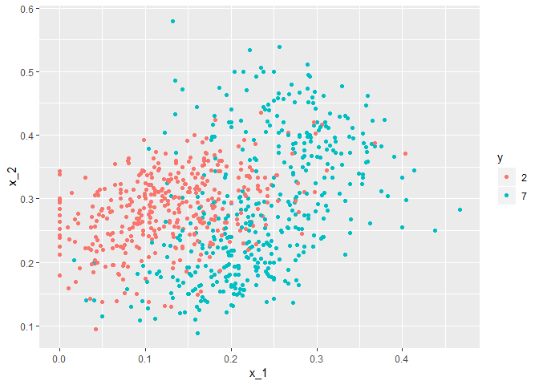
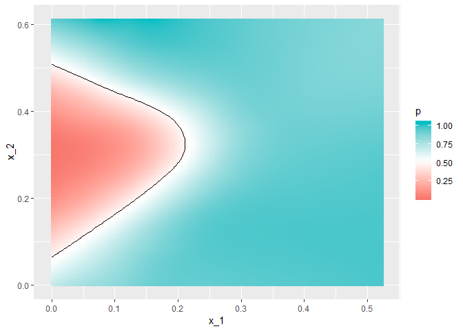
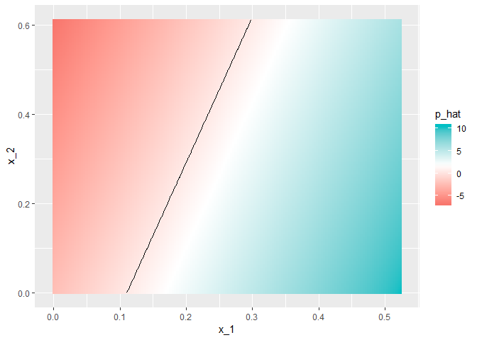
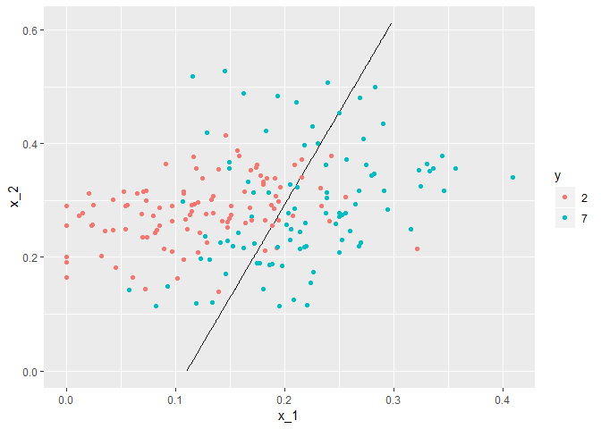

MNIST
================

### MNIST dataset - Logistic regression

Classification of mnist data for digits 2 and 7

Load the data

``` r
data("mnist_27")
mnist_27$train %>% ggplot(aes(x_1, x_2, color = y)) + geom_point()
```



Create logistic regression model

``` r
fit <- glm(y ~ x_1 + x_2, data=mnist_27$train, family="binomial")
```

Predict with the glm model and classification

``` r
p_hat <- predict(fit, newdata = mnist_27$test)
y_hat <- factor(ifelse(p_hat > 0.5, 7, 2)) 
```

Confusion matrix

``` r
confusionMatrix(data = y_hat, reference = mnist_27$test$y) 
```

    ## Confusion Matrix and Statistics
    ## 
    ##           Reference
    ## Prediction  2  7
    ##          2 92 34
    ##          7 14 60
    ##                                           
    ##                Accuracy : 0.76            
    ##                  95% CI : (0.6947, 0.8174)
    ##     No Information Rate : 0.53            
    ##     P-Value [Acc > NIR] : 1.668e-11       
    ##                                           
    ##                   Kappa : 0.5124          
    ##  Mcnemar's Test P-Value : 0.006099        
    ##                                           
    ##             Sensitivity : 0.8679          
    ##             Specificity : 0.6383          
    ##          Pos Pred Value : 0.7302          
    ##          Neg Pred Value : 0.8108          
    ##              Prevalence : 0.5300          
    ##          Detection Rate : 0.4600          
    ##    Detection Prevalence : 0.6300          
    ##       Balanced Accuracy : 0.7531          
    ##                                           
    ##        'Positive' Class : 2               
    ## 

Plot true probabilities

``` r
mnist_27$true_p %>% ggplot(aes(x_1, x_2, z=p, fill=p)) +  geom_raster() + 
  scale_fill_gradientn(colors=c("#F8766D","white","#00BFC4")) +  
  stat_contour(breaks=c(0.5),color="black")
```



Predict the probabilities with Logistic Regression and Plot predicted probabilities

``` r
p_hat <- predict(fit, newdata = mnist_27$true_p) 

mnist_27$true_p %>% mutate(p_hat = p_hat) %>% 
  ggplot(aes(x_1, x_2,  z=p_hat, fill=p_hat)) + geom_raster() +   
  scale_fill_gradientn(colors=c("#F8766D","white","#00BFC4")) +   
  stat_contour(breaks=c(0.5),color="black") 
```



Plot Logistic regression line with test data

``` r
mnist_27$true_p %>% mutate(p_hat = p_hat) %>% ggplot() +   
  stat_contour(aes(x_1, x_2, z=p_hat), breaks=c(0.5), color="black") +    
  geom_point(mapping = aes(x_1, x_2, color=y), data = mnist_27$test) 
```



Logistic regression is able to classify the data with 76% accuracy.
