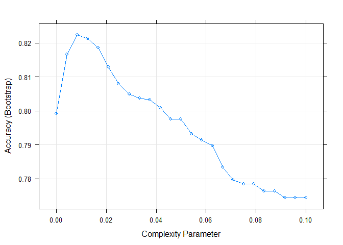
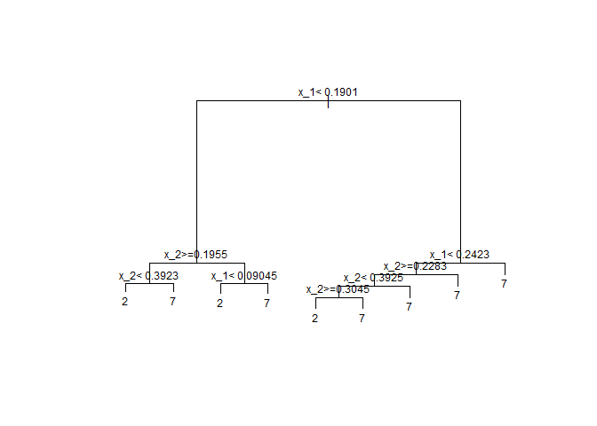

MNIST
================

### MNIST prediction with Classification trees

Load the data

``` r
data("mnist_27")
train_rpart <- train(y~., method="rpart", tuneGrid=data.frame(cp=seq(0.0, 0.1, len=25)),
                     data=mnist_27$train)
```

Plot accuracy and complexity parameter

``` r
plot(train_rpart)
```



Plot the decision tree

``` r
plot(train_rpart$finalModel, margin = 0.1)
text(train_rpart$finalModel, cex = 0.75)
```



Confusion Matrix

``` r
confusionMatrix(train_rpart)
```

    ## Bootstrapped (25 reps) Confusion Matrix 
    ## 
    ## (entries are percentual average cell counts across resamples)
    ##  
    ##           Reference
    ## Prediction    2    7
    ##          2 38.2  8.8
    ##          7  8.9 44.0
    ##                             
    ##  Accuracy (average) : 0.8223

Confusion matrix

``` r
confusionMatrix(predict(train_rpart, mnist_27$test), mnist_27$test$y)
```

    ## Confusion Matrix and Statistics
    ## 
    ##           Reference
    ## Prediction  2  7
    ##          2 92 22
    ##          7 14 72
    ##                                           
    ##                Accuracy : 0.82            
    ##                  95% CI : (0.7596, 0.8706)
    ##     No Information Rate : 0.53            
    ##     P-Value [Acc > NIR] : <2e-16          
    ##                                           
    ##                   Kappa : 0.637           
    ##  Mcnemar's Test P-Value : 0.2433          
    ##                                           
    ##             Sensitivity : 0.8679          
    ##             Specificity : 0.7660          
    ##          Pos Pred Value : 0.8070          
    ##          Neg Pred Value : 0.8372          
    ##              Prevalence : 0.5300          
    ##          Detection Rate : 0.4600          
    ##    Detection Prevalence : 0.5700          
    ##       Balanced Accuracy : 0.8169          
    ##                                           
    ##        'Positive' Class : 2               
    ##
