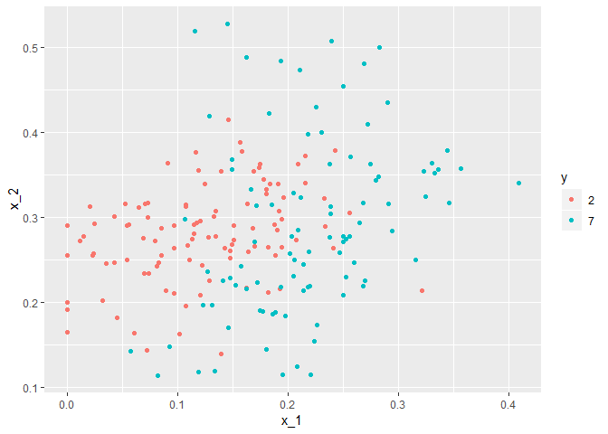
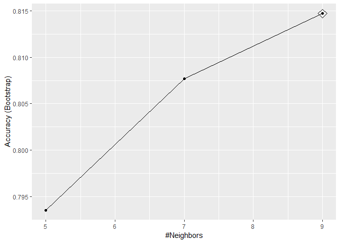
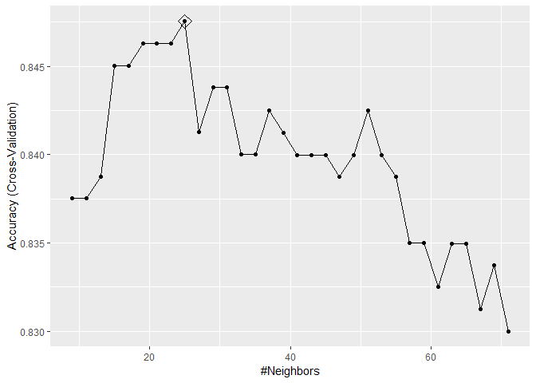
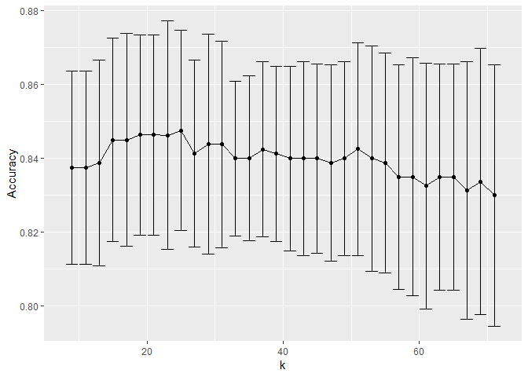

MNIST
================

### MNIST prediction with KNN

Load the data

``` r
data("mnist_27") 
# Plot the data for digits 2 and 7
mnist_27$test%>% ggplot(aes(x_1, x_2, color = y)) + geom_point()
```



Create the train set

``` r
x <- as.matrix(mnist_27$train[,2:3])
y <- mnist_27$train$y
```

Modeling

``` r
knn_fit <- knn3(y ~ ., data = mnist_27$train, k = 5)
# Prediction
y_hat_knn <- predict(knn_fit, mnist_27$test, type= "class")
# Confusion Marix
confusionMatrix(data= y_hat_knn, reference = mnist_27$test$y)$overall["Accuracy"] 
```

    ## Accuracy 
    ##    0.815

Crossvalidation with default values in caret

``` r
train_knn <- train(y ~ ., method = "knn", data = mnist_27$train)
ggplot(train_knn, highlight = TRUE)
```



Crossvalidation with trainControl and tuneGrid

``` r
control <- trainControl(method = "cv", number = 10, p = 0.9) 
train_knn_cv <- train(y ~ ., method = "knn",                     
                      data = mnist_27$train,                    
                      tuneGrid = data.frame(k = seq(9, 71, 2)),                    
                      trControl = control) 
ggplot(train_knn_cv, highlight = TRUE)
```



``` r
train_knn_cv$bestTune 
```

    ##    k
    ## 9 25

``` r
train_knn_cv$finalModel
```

    ## 25-nearest neighbor model
    ## Training set outcome distribution:
    ## 
    ##   2   7 
    ## 379 421

Plot the accuracy

``` r
train_knn_cv$results %>%    
  ggplot(aes(x = k, y = Accuracy)) +   geom_line() +   geom_point() +   
  geom_errorbar(aes(x = k,
                    ymin = Accuracy - AccuracySD,                      
                    ymax = Accuracy + AccuracySD))
```



Prediction

``` r
Pred_knn_cv <- predict(train_knn_cv, mnist_27$test,type="raw")
# confusion matrix
cm <- confusionMatrix(Pred_knn_cv, mnist_27$test$y)
cm
```

    ## Confusion Matrix and Statistics
    ## 
    ##           Reference
    ## Prediction  2  7
    ##          2 92 19
    ##          7 14 75
    ##                                           
    ##                Accuracy : 0.835           
    ##                  95% CI : (0.7762, 0.8836)
    ##     No Information Rate : 0.53            
    ##     P-Value [Acc > NIR] : <2e-16          
    ##                                           
    ##                   Kappa : 0.6678          
    ##  Mcnemar's Test P-Value : 0.4862          
    ##                                           
    ##             Sensitivity : 0.8679          
    ##             Specificity : 0.7979          
    ##          Pos Pred Value : 0.8288          
    ##          Neg Pred Value : 0.8427          
    ##              Prevalence : 0.5300          
    ##          Detection Rate : 0.4600          
    ##    Detection Prevalence : 0.5550          
    ##       Balanced Accuracy : 0.8329          
    ##                                           
    ##        'Positive' Class : 2               
    ## 

``` r
cm$overall["Accuracy"] 
```

    ## Accuracy 
    ##    0.835
