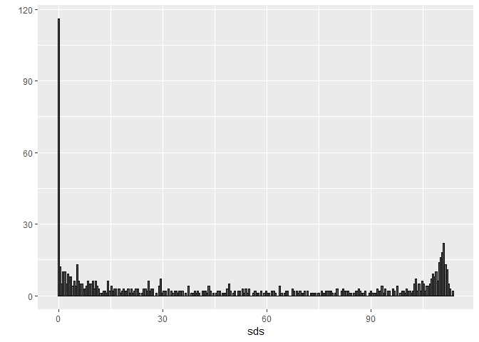
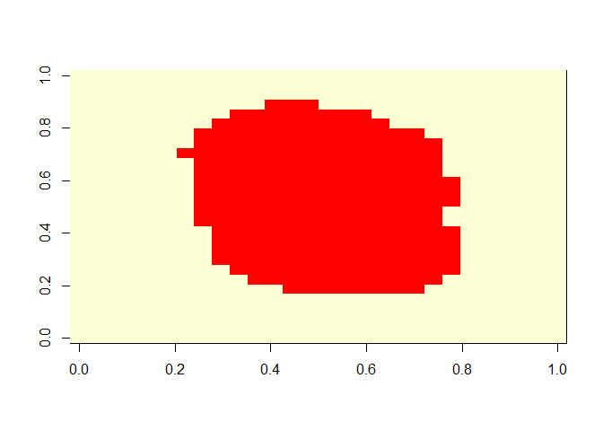
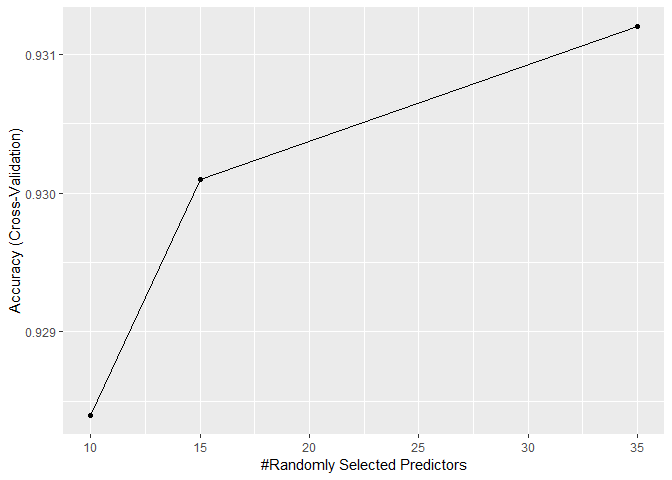
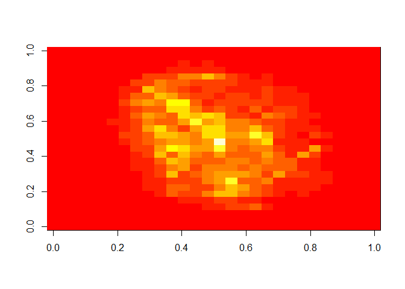
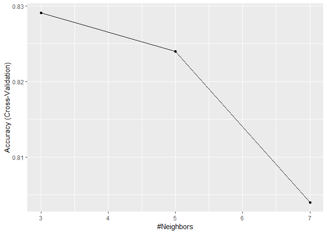

MNIST
================

### MNIST data prediction with Random forest

Load the data

``` r
mnist <- read_mnist()
names(mnist)
```

    ## [1] "train" "test"

``` r
dim(mnist$train$images) 
```

    ## [1] 60000   784

``` r
class(mnist$train$labels) 
```

    ## [1] "integer"

``` r
table(mnist$train$labels) 
```

    ## 
    ##    0    1    2    3    4    5    6    7    8    9 
    ## 5923 6742 5958 6131 5842 5421 5918 6265 5851 5949

Subsetting the data for train

``` r
set.seed(123) 
index <- sample(nrow(mnist$train$images), 10000) 
x <- mnist$train$images[index,] 
y <- factor(mnist$train$labels[index]) 
```

Subsetting the data for test

``` r
index <- sample(nrow(mnist$train$images), 1000) 
x_test <- mnist$train$images[index,] 
y_test <- factor(mnist$train$labels[index])
```

Explore the data

``` r
sds <- colSds(x) 
qplot(sds, bins = 256, color = I("black"))
```



Identification of near zero variance predictors with nearZeroVar function in caret package

``` r
nzv <- nearZeroVar(x) # removes columns with near zero variance
image(matrix(1:784 %in% nzv, 28, 28)) # shows removed or near zero variance columns
```



Get the col index for analysis

``` r
col_index <- setdiff(1:ncol(x), nzv) 
length(col_index) 
```

    ## [1] 252

Get the columns named in train and test for analysis

``` r
colnames(x) <- 1:ncol(mnist$train$images) 
colnames(x_test) <- colnames(mnist$train$images)
```

Tuning the parameters with crossvalidation

``` r
control <- trainControl(method="cv", number = 5, p = 0.8) 
grid <- expand.grid(minNode = c(1) , predFixed = c(10, 15, 35))
train_rf <-  train(x[ , col_index],                     
                   y,                     
                   method = "Rborist",                     
                   nTree = 50,                    
                   trControl = control,                    
                   tuneGrid = grid,                    
                   nSamp = 5000) 
ggplot(train_rf) 
```



Get the best tuning parameter

``` r
train_rf$bestTune 
```

    ##   predFixed minNode
    ## 3        35       1

Modeling

``` r
fit_rf <- Rborist(x[ ,col_index], y,                    
                  nTree = 1000,                   
                  minNode = train_rf$bestTune$minNode,                   
                  predFixed = train_rf$bestTune$predFixed)
```

Prediction

``` r
pred <- predict(fit_rf, x_test[ ,col_index])
```

Getting predicted values in the same levels of y

``` r
y_hat_rf <- factor(levels(y)[pred$yPred]) 
```

Confusion matrix

``` r
cm <- confusionMatrix(y_hat_rf, y_test) 
cm
```

    ## Confusion Matrix and Statistics
    ## 
    ##           Reference
    ## Prediction   0   1   2   3   4   5   6   7   8   9
    ##          0 100   0   0   0   1   0   0   0   0   0
    ##          1   0 106   2   0   1   0   0   0   1   0
    ##          2   0   0  93   4   0   0   0   1   0   0
    ##          3   0   0   0  82   0   3   0   0   3   1
    ##          4   0   1   2   0 105   0   1   2   0   0
    ##          5   0   0   0   1   0  91   0   0   1   2
    ##          6   0   0   1   0   0   1  95   0   0   0
    ##          7   0   0   4   0   1   0   0  92   0   1
    ##          8   0   0   1   1   1   2   0   0  92   1
    ##          9   0   0   0   0   2   1   0   1   0  99
    ## 
    ## Overall Statistics
    ##                                          
    ##                Accuracy : 0.955          
    ##                  95% CI : (0.9402, 0.967)
    ##     No Information Rate : 0.111          
    ##     P-Value [Acc > NIR] : < 2.2e-16      
    ##                                          
    ##                   Kappa : 0.95           
    ##  Mcnemar's Test P-Value : NA             
    ## 
    ## Statistics by Class:
    ## 
    ##                      Class: 0 Class: 1 Class: 2 Class: 3 Class: 4 Class: 5
    ## Sensitivity            1.0000   0.9907   0.9029   0.9318   0.9459   0.9286
    ## Specificity            0.9989   0.9955   0.9944   0.9923   0.9933   0.9956
    ## Pos Pred Value         0.9901   0.9636   0.9490   0.9213   0.9459   0.9579
    ## Neg Pred Value         1.0000   0.9989   0.9889   0.9934   0.9933   0.9923
    ## Prevalence             0.1000   0.1070   0.1030   0.0880   0.1110   0.0980
    ## Detection Rate         0.1000   0.1060   0.0930   0.0820   0.1050   0.0910
    ## Detection Prevalence   0.1010   0.1100   0.0980   0.0890   0.1110   0.0950
    ## Balanced Accuracy      0.9994   0.9931   0.9487   0.9621   0.9696   0.9621
    ##                      Class: 6 Class: 7 Class: 8 Class: 9
    ## Sensitivity            0.9896   0.9583   0.9485   0.9519
    ## Specificity            0.9978   0.9934   0.9934   0.9955
    ## Pos Pred Value         0.9794   0.9388   0.9388   0.9612
    ## Neg Pred Value         0.9989   0.9956   0.9945   0.9944
    ## Prevalence             0.0960   0.0960   0.0970   0.1040
    ## Detection Rate         0.0950   0.0920   0.0920   0.0990
    ## Detection Prevalence   0.0970   0.0980   0.0980   0.1030
    ## Balanced Accuracy      0.9937   0.9758   0.9709   0.9737

``` r
cm$overall["Accuracy"] 
```

    ## Accuracy 
    ##    0.955

MNIST data prediction with random forest using randomforest package
===================================================================

``` r
rf <- randomForest(x, y,  ntree = 50)
imp <- importance(rf)
```

Plot the imp variables in to image

``` r
image(matrix(imp, 28, 28))
```



MNIST data prediction with knn
==============================

Crossvalidation for tuning the parameters

``` r
n <- 1000 
b <- 2 
index <- sample(nrow(x), n) 
control <- trainControl(method = "cv", number = b, p = .9) 
train_knn <- train(x[index ,col_index], y[index],
                   method = "knn",                     
                   tuneGrid = data.frame(k = c(3,5,7)),                    
                   trControl = control)
ggplot(train_knn)
```



Modeling

``` r
fit_knn<- knn3(x[ ,col_index], y,  k = 5)
```

Prediction

``` r
y_hat_knn <- predict(fit_knn,                          
                     x_test[, col_index],                          
                     type="class") 
```

Confusion Matrix

``` r
cm <- confusionMatrix(y_hat_knn, factor(y_test)) 
cm$overall["Accuracy"]
```

    ## Accuracy 
    ##    0.949

Try Ensemble with randomforest and knn for prediction
=====================================================

predict with randomforest, get the predictions

``` r
p_rf <- predict(fit_rf, x_test[,col_index])$census
p_rf<- p_rf / rowSums(p_rf) 
```

Predict with KNN

``` r
p_knn  <- predict(fit_knn, x_test[,col_index], data=mnist$test) 
```

Get the averages probabilities

``` r
p <- (p_rf + p_knn)/2 
```

Predicted class

``` r
y_pred <- factor(apply(p, 1, which.max)-1) 
```

Confusion Matrix

``` r
confusionMatrix(y_pred, y_test)
```

    ## Confusion Matrix and Statistics
    ## 
    ##           Reference
    ## Prediction   0   1   2   3   4   5   6   7   8   9
    ##          0 100   0   2   0   1   0   0   0   0   0
    ##          1   0 106   2   0   2   0   0   1   2   0
    ##          2   0   0  93   2   0   0   0   0   1   0
    ##          3   0   0   0  85   0   2   0   0   3   0
    ##          4   0   0   1   0 104   0   1   0   0   1
    ##          5   0   0   0   1   0  94   0   0   1   2
    ##          6   0   0   0   0   0   1  95   0   0   0
    ##          7   0   0   5   0   1   0   0  94   0   2
    ##          8   0   0   0   0   0   0   0   0  90   0
    ##          9   0   1   0   0   3   1   0   1   0  99
    ## 
    ## Overall Statistics
    ##                                           
    ##                Accuracy : 0.96            
    ##                  95% CI : (0.9459, 0.9713)
    ##     No Information Rate : 0.111           
    ##     P-Value [Acc > NIR] : < 2.2e-16       
    ##                                           
    ##                   Kappa : 0.9555          
    ##  Mcnemar's Test P-Value : NA              
    ## 
    ## Statistics by Class:
    ## 
    ##                      Class: 0 Class: 1 Class: 2 Class: 3 Class: 4 Class: 5
    ## Sensitivity            1.0000   0.9907   0.9029   0.9659   0.9369   0.9592
    ## Specificity            0.9967   0.9922   0.9967   0.9945   0.9966   0.9956
    ## Pos Pred Value         0.9709   0.9381   0.9688   0.9444   0.9720   0.9592
    ## Neg Pred Value         1.0000   0.9989   0.9889   0.9967   0.9922   0.9956
    ## Prevalence             0.1000   0.1070   0.1030   0.0880   0.1110   0.0980
    ## Detection Rate         0.1000   0.1060   0.0930   0.0850   0.1040   0.0940
    ## Detection Prevalence   0.1030   0.1130   0.0960   0.0900   0.1070   0.0980
    ## Balanced Accuracy      0.9983   0.9914   0.9498   0.9802   0.9668   0.9774
    ##                      Class: 6 Class: 7 Class: 8 Class: 9
    ## Sensitivity            0.9896   0.9792   0.9278   0.9519
    ## Specificity            0.9989   0.9912   1.0000   0.9933
    ## Pos Pred Value         0.9896   0.9216   1.0000   0.9429
    ## Neg Pred Value         0.9989   0.9978   0.9923   0.9944
    ## Prevalence             0.0960   0.0960   0.0970   0.1040
    ## Detection Rate         0.0950   0.0940   0.0900   0.0990
    ## Detection Prevalence   0.0960   0.1020   0.0900   0.1050
    ## Balanced Accuracy      0.9942   0.9852   0.9639   0.9726
