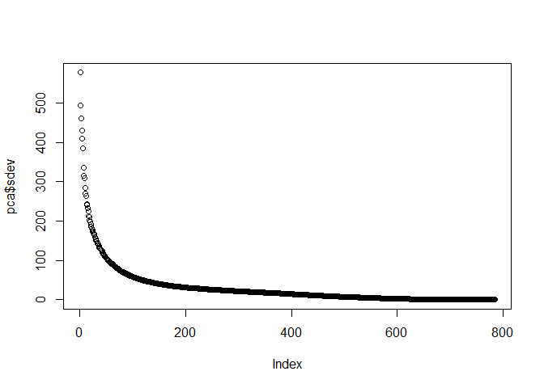
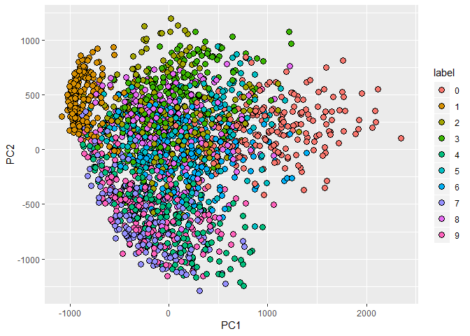
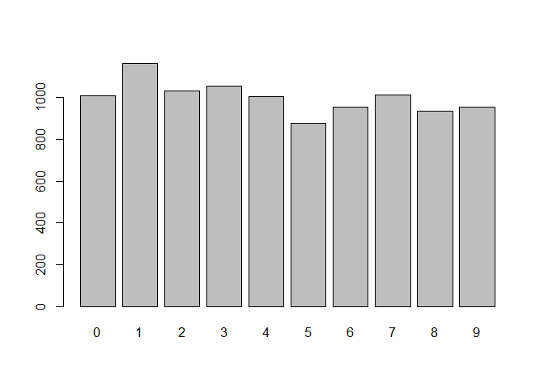

MNIST
================

### MNIST data prediction with PCA and SVM

Load the data

``` r
mnist <- read_mnist()
```

Run PCA

``` r
pca <- prcomp(mnist$train$images)

plot(pca$sdev)
```



``` r
summary(pca)$importance[,1:5] %>% knitr::kable()
```

|                        |        PC1|        PC2|        PC3|        PC4|        PC5|
|------------------------|----------:|----------:|----------:|----------:|----------:|
| Standard deviation     |  576.82291|  493.23822|  459.89930|  429.85624|  408.56680|
| Proportion of Variance |    0.09705|    0.07096|    0.06169|    0.05389|    0.04869|
| Cumulative Proportion  |    0.09705|    0.16801|    0.22970|    0.28359|    0.33228|

Plot 2000 samples digits with PC1 and PC2

``` r
data.frame(PC1 = pca$x[,1], PC2 = pca$x[,2],            
           label=factor(mnist$train$label)) %>%   
  sample_n(2000) %>%    
  ggplot(aes(PC1, PC2, fill=label))+   
  geom_point(cex=3, pch=21)
```



Taking 36 principal components to analyse the data create train and test sets with x & y components

``` r
K <- 36 
x_train <- pca$x[,1:K] 
y <- factor(mnist$train$labels) 

col_means <- colMeans(mnist$test$images) 
x_test <- sweep(mnist$test$images, 2, col_means) %*% pca$rotation 
x_test <- x_test[,1:K]
```

Model with Support vector machine algorithm

``` r
svm.linear <- ksvm(y~x_train, scale =FALSE, kernel="vanilladot")
```

    ##  Setting default kernel parameters

``` r
predict <- predict(svm.linear, x_test)
confusionMatrix(predict, factor(mnist$test$labels))
```

    ## Confusion Matrix and Statistics
    ## 
    ##           Reference
    ## Prediction    0    1    2    3    4    5    6    7    8    9
    ##          0  967    0    8    3    2   10    7    2    7    4
    ##          1    0 1123    6    2    0    5    3    9    5   10
    ##          2    2    1  951   13    5   11   10   26    8    4
    ##          3    2    2   13  938    0   53    2    5   26   15
    ##          4    0    0   10    1  933    6    7    8    6   33
    ##          5    5    3    6   22    3  783   12    0   34   11
    ##          6    2    1   11    1    5    8  916    0   10    1
    ##          7    1    0    9   11    4    2    1  958    3   25
    ##          8    1    5   18   15    2   11    0    4  869    9
    ##          9    0    0    0    4   28    3    0   16    6  897
    ## 
    ## Overall Statistics
    ##                                           
    ##                Accuracy : 0.9335          
    ##                  95% CI : (0.9284, 0.9383)
    ##     No Information Rate : 0.1135          
    ##     P-Value [Acc > NIR] : < 2.2e-16       
    ##                                           
    ##                   Kappa : 0.9261          
    ##  Mcnemar's Test P-Value : NA              
    ## 
    ## Statistics by Class:
    ## 
    ##                      Class: 0 Class: 1 Class: 2 Class: 3 Class: 4 Class: 5
    ## Sensitivity            0.9867   0.9894   0.9215   0.9287   0.9501   0.8778
    ## Specificity            0.9952   0.9955   0.9911   0.9869   0.9921   0.9895
    ## Pos Pred Value         0.9574   0.9656   0.9224   0.8883   0.9293   0.8908
    ## Neg Pred Value         0.9986   0.9986   0.9910   0.9919   0.9946   0.9880
    ## Prevalence             0.0980   0.1135   0.1032   0.1010   0.0982   0.0892
    ## Detection Rate         0.0967   0.1123   0.0951   0.0938   0.0933   0.0783
    ## Detection Prevalence   0.1010   0.1163   0.1031   0.1056   0.1004   0.0879
    ## Balanced Accuracy      0.9910   0.9925   0.9563   0.9578   0.9711   0.9336
    ##                      Class: 6 Class: 7 Class: 8 Class: 9
    ## Sensitivity            0.9562   0.9319   0.8922   0.8890
    ## Specificity            0.9957   0.9938   0.9928   0.9937
    ## Pos Pred Value         0.9592   0.9448   0.9304   0.9403
    ## Neg Pred Value         0.9954   0.9922   0.9884   0.9876
    ## Prevalence             0.0958   0.1028   0.0974   0.1009
    ## Detection Rate         0.0916   0.0958   0.0869   0.0897
    ## Detection Prevalence   0.0955   0.1014   0.0934   0.0954
    ## Balanced Accuracy      0.9759   0.9628   0.9425   0.9413

Plot the predictions

``` r
plot(predict)
```


