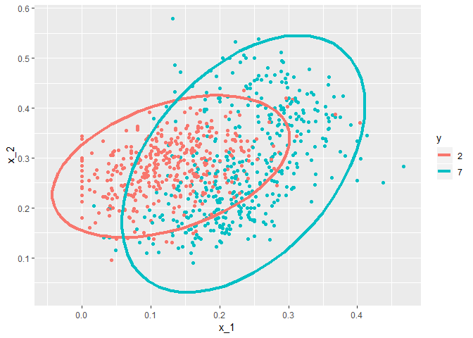
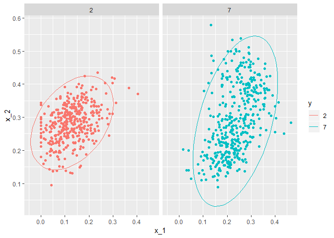

MNIST
================

MNIST data prediction with QDA and LDA

QDA
---

``` r
data("mnist_27")
params <- mnist_27$train %>% group_by(y) %>% 
  summarize(avg_1 = mean(x_1), avg_2= mean(x_2), sd_1= sd(x_1), sd_2= sd(x_2), 
            r= cor(x_1, x_2))
params
```

    ## # A tibble: 2 x 6
    ##   y     avg_1 avg_2   sd_1   sd_2     r
    ##   <fct> <dbl> <dbl>  <dbl>  <dbl> <dbl>
    ## 1 2     0.129 0.283 0.0702 0.0578 0.401
    ## 2 7     0.234 0.288 0.0719 0.105  0.455

Plot the X\_1 and X\_2 of 2 and 7

``` r
mnist_27$train %>% mutate(y = factor(y)) %>%  
  ggplot(aes(x_1, x_2, fill = y, color=y)) +    
  geom_point(show.legend = FALSE) + 
  stat_ellipse(type="norm", lwd = 1.5)
```



Fitting the model

``` r
train_qda <- train(y ~. , method= "qda", data= mnist_27$train)
```

Predicting

``` r
y_hat <- predict(train_qda, mnist_27$test)
```

ConfusionMatrix

``` r
confusionMatrix(data= y_hat, reference= mnist_27$test$y)$overall["Accuracy"]
```

    ## Accuracy 
    ##     0.82

K \* (2p + p \* (p-1) / 2) number of parameters will have to be estimated for qda. quadratic function should hold in qda. multivariate distribution of normality should hold to do qda assumption of normality does not quite hold here

``` r
mnist_27$train %>% mutate(y = factor(y)) %>%    
  ggplot(aes(x_1, x_2, fill = y, color=y)) +    
  geom_point(show.legend = FALSE) +    
  stat_ellipse(type="norm") +   
  facet_wrap(~y)
```



LDA
---

when predictors are large we assume the correlations are same for all the classes. so it will be LDA as the same sd, correlation conditiond are forced in the data. flexibility of the model is less here.

Assuming the sd and correlation to be same

``` r
params <- mnist_27$train %>%  group_by(y) %>% 
summarize(avg_1 = mean(x_1), avg_2 = mean(x_2), sd_1= sd(x_1), sd_2 = sd(x_2), 
r = cor(x_1, x_2))
 
params_1 <-params %>% mutate(sd_1 = mean(sd_1), sd_2=mean(sd_2), r=mean(r))
params_1
```

    ## # A tibble: 2 x 6
    ##   y     avg_1 avg_2   sd_1   sd_2     r
    ##   <fct> <dbl> <dbl>  <dbl>  <dbl> <dbl>
    ## 1 2     0.129 0.283 0.0710 0.0813 0.428
    ## 2 7     0.234 0.288 0.0710 0.0813 0.428

Fitting the model

``` r
train_lda <- train(y ~. , method= "lda", data= mnist_27$train)
```

Predictiing

``` r
y_hat <- predict(train_lda, mnist_27$test)
```

Confusion matrix

``` r
confusionMatrix(data= y_hat, reference= mnist_27$test$y)$overall["Accuracy"]
```

    ## Accuracy 
    ##     0.75
